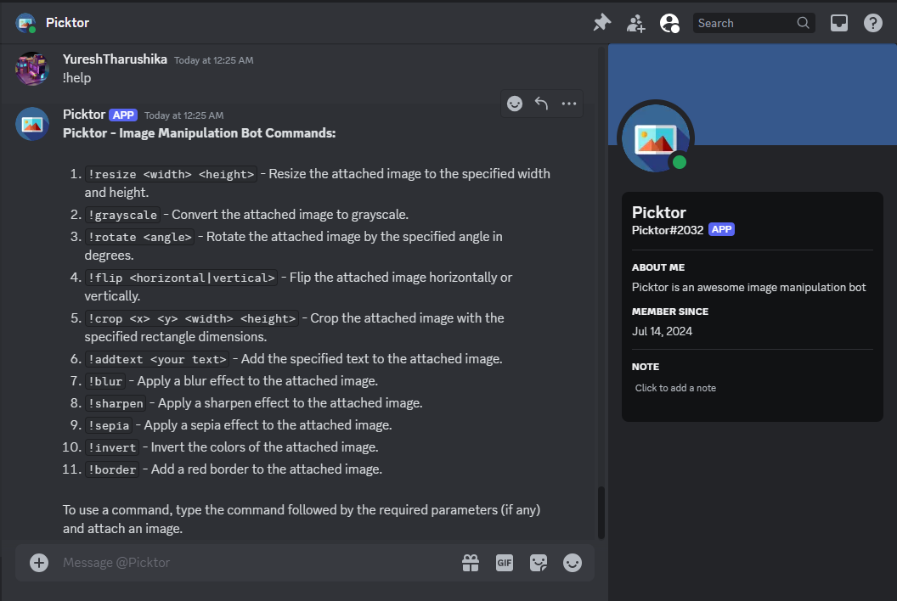

Picktor - Discord Image Manipulation Bot
========================================


Picktor is a Discord bot that provides various image manipulation functionalities directly within your Discord server. It allows users to resize, rotate, grayscale, and apply other effects to images by simply using commands.

Features
--------

-   **Resize Images:** Adjust the dimensions of an image.
-   **Grayscale:** Convert images to grayscale.
-   **Rotate:** Rotate images by a specified angle.
-   **Flip:** Flip images horizontally or vertically.
-   **Crop:** Crop images to a specified rectangle.
-   **Add Text:** Overlay text onto images.
-   **Blur:** Apply a blur effect to images.
-   **Sharpen:** Apply a sharpen effect to images.
-   **Sepia:** Apply a sepia effect to images.
-   **Invert Colors:** Invert the colors of images.
-   **Add Border:** Draw a red border around images.

Commands
--------

1.  `!resize <width> <height>` - Resize the attached image to the specified width and height.
2.  `!grayscale` - Convert the attached image to grayscale.
3.  `!rotate <angle>` - Rotate the attached image by the specified angle in degrees.
4.  `!flip <horizontal|vertical>` - Flip the attached image horizontally or vertically.
5.  `!crop <x> <y> <width> <height>` - Crop the attached image with the specified rectangle dimensions.
6.  `!addtext <your text>` - Add the specified text to the attached image.
7.  `!blur` - Apply a blur effect to the attached image.
8.  `!sharpen` - Apply a sharpen effect to the attached image.
9.  `!sepia` - Apply a sepia effect to the attached image.
10. `!invert` - Invert the colors of the attached image.
11. `!border` - Add a red border to the attached image.
12. `!help` - Display the help message with all available commands.

Getting Started
---------------

To get a copy of Picktor up and running on your local machine for development and testing purposes, follow these steps.

### Prerequisites

-   [.NET Core 8.0 SDK](https://dotnet.microsoft.com/download/dotnet/8.0)
-   [Discord.NET Library](https://discordnet.dev/)
-   [SixLabors.ImageSharp](https://github.com/SixLabors/ImageSharp)

### Installation

1.  Clone the repository:

    ```
    git clone https://github.com/YureshTharushika/Picktor.git
    cd picktor

2.  Restore the required packages:

    
    ```
    dotnet restore

3.  Create a `appsettings.json` file in the root directory of your project and add your Discord bot token:


    `{
      "DiscordToken": "YOUR_DISCORD_BOT_TOKEN"
    }`

4.  Build and run the application:

    
    ```
    dotnet run

Usage
-----

1.  Invite Picktor to your Discord server using your bot's invite link.
2.  Use the commands in any text channel where the bot has permission to read and send messages.
3.  Attach an image and type a command to manipulate the image. For example, to resize an image, type `!resize 800 600` and attach an image.

Contributing
------------

Contributions are welcome! Please feel free to submit a Pull Request.

1. Fork the repository
2. Create your feature branch (`git checkout -b feature/AmazingFeature`)
3. Commit your changes (`git commit -m 'Add some AmazingFeature'`)
4. Push to the branch (`git push origin feature/AmazingFeature`)
5. Open a pull request

Acknowledgements
----------------

-   [Discord.NET](https://discordnet.dev/) - A .NET library for interacting with the Discord API.
-   [SixLabors.ImageSharp](https://github.com/SixLabors/ImageSharp) - A cross-platform library for processing images.
